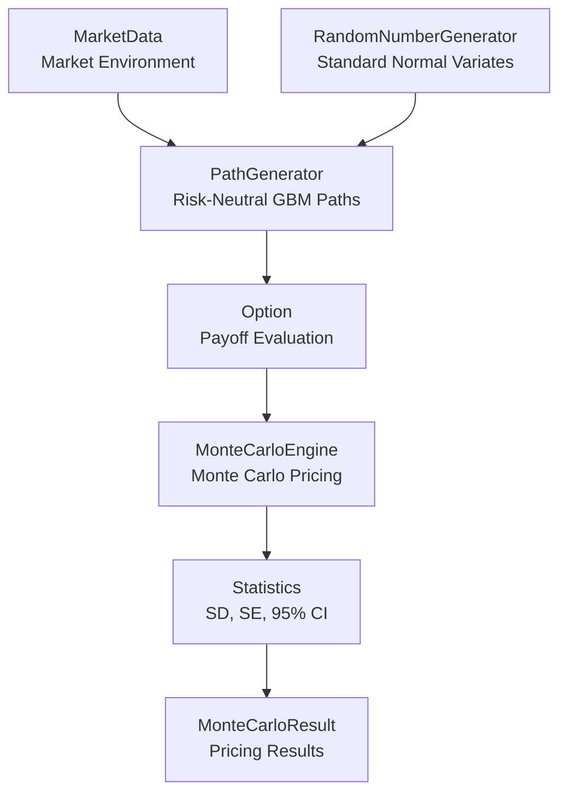

# Monte Carlo Pricing Library for Exotic Options

A modular C++ framework for pricing vanilla and exotic equity derivatives using Monte Carlo simulation under the Black-Scholes framework. The library combines object-oriented product design, reusable pricing engines, statistical error estimation, analytical benchmark validation, and numerical convergence studies within a unified architecture.

---

## Project Overview

This project implements a Monte Carlo pricing framework for a range of path-dependent option products. The library is designed around a clear separation between product definitions, path generation, pricing engines, and statistical analysis, allowing new option types and numerical methods to be added with minimal modification to existing components.

In addition to pricing functionality, the framework includes validation tests, convergence studies, and timestep sensitivity analysis to investigate the numerical behaviour of Monte Carlo methods for exotic options.

**Key methodologies:**

* Risk-neutral Monte Carlo pricing
* Exact geometric Brownian motion (GBM) path simulation
* Statistical error estimation
* 95% confidence interval analysis
* Analytical Black-Scholes benchmark validation
* Simulation convergence studies
* Timestep sensitivity analysis
* Object-oriented product and engine design

---

## Supported Products

The current implementation supports the following option products:

| Product         | Variants                                  |
| --------------- | ----------------------------------------- |
| European Option | Call, Put                                 |
| Binary Option   | Cash-or-Nothing Call, Cash-or-Nothing Put |
| Asian Option    | Fixed Strike, Floating Strike, Call, Put  |
| Barrier Option  | Up/Down, Knock-In/Knock-Out, Call, Put    |
| Lookback Option | Fixed Strike, Floating Strike, Call, Put  |

### European Options

European options can only be exercised at maturity and serve as benchmark products because analytical Black-Scholes prices are available for validation.

### Binary Options

Binary (cash-or-nothing) options pay a fixed cash amount if the option finishes in-the-money at maturity. Analytical Black-Scholes benchmark prices are available and are used to validate the Monte Carlo implementation.

### Asian Options

Asian options depend on the arithmetic average asset price observed along the simulated path. The library supports both fixed-strike and floating-strike Asian calls and puts.

### Barrier Options

Barrier options depend on whether the underlying asset breaches a specified barrier level during the option's lifetime. The library supports knock-in and knock-out structures with both up and down barriers for calls and puts.

### Lookback Options

Lookback options depend on the maximum or minimum asset price observed during the life of the option. Both fixed-strike and floating-strike lookback calls and puts are supported.

---

## Library Architecture

The library is organised into four main components:

| Component   | Responsibility                                                                                 |
| ----------- | ---------------------------------------------------------------------------------------------- |
| `Core`      | Market data, random number generation, Monte Carlo result storage and statistical calculations |
| `Option`    | Product definitions, option enums and payoff logic                                             |
| `Engine`    | Asset path generation, Monte Carlo pricing and analytical Black-Scholes benchmarks             |
| `Utilities` | Result formatting and validation output                                                        |

### Pricing Workflow



The workflow can be interpreted as:

* `MarketData` provides the market environment, including spot price, risk-free rate, volatility and continuous dividend yield.
* `RandomNumberGenerator` generates the standard normal variates required for path simulation.
* `PathGenerator` simulates risk-neutral asset paths under the Black-Scholes framework using the exact geometric Brownian motion transition.
* `Option` evaluates the payoff on each simulated path according to the selected product specification.
* `MonteCarloEngine` aggregates discounted payoffs across all simulation paths and computes the Monte Carlo price estimate.
* `Statistics` computes standard deviation, standard error and approximate 95% confidence intervals.
* `MonteCarloResult` stores the final pricing output and statistical summary.

### Product-Oriented Design

All option products inherit from a common `Option` base class and implement their own payoff logic.

```
Option
├── EuropeanOption
├── BinaryOption
├── AsianOption
├── BarrierOption
└── LookbackOption
```

This design allows the Monte Carlo engine to price different products through a common interface without modifying the simulation framework.

### Validation-Oriented Design

Validation logic is separated from the pricing engine. Analytical benchmark checks, product-specific consistency tests, convergence studies and timestep sensitivity studies are implemented in the `tests/` and `examples/` directories.

This separation keeps the core pricing library reusable while allowing numerical experiments and validation programs to be developed independently.


---

## Repository Structure

```
monte-carlo-exotic-option-pricing/
├── README.md
├── .gitignore
├── MonteCarloExoticOptions.sln
├── MonteCarloExoticOptions.vcxproj
├── MonteCarloExoticOptions.vcxproj.filters
│
├── include/
│   ├── Core/          # Market data, RNG, statistics and result containers
│   ├── Option/        # Option base class, enums and product definitions
│   ├── Engine/        # Path generation, Monte Carlo engine and analytical engine
│   └── Utilities/     # Output formatting utilities
│
├── src/
│   ├── Core/          # Core implementation files
│   ├── Option/        # Option payoff implementation files
│   ├── Engine/        # Pricing engine implementation files
│   └── Utilities/     # Output formatting implementation files
│
├── examples/
│   ├── ExampleEuropean.cpp
│   ├── ExampleBinary.cpp
│   ├── ExampleAsian.cpp
│   ├── ExampleBarrier.cpp
│   ├── ExampleLookback.cpp
│   ├── ExampleSimulationConvergence.cpp
│   └── ExampleTimestepSensitivity.cpp
│
├── tests/
│   ├── TestEuropean.cpp
│   ├── TestBinary.cpp
│   ├── TestAsian.cpp
│   ├── TestBarrier.cpp
│   ├── TestLookback.cpp
│   └── TestMonteCarloEngine.cpp
│
└── docs/
    ├── Monte_Carlo_Framework.md
    ├── Option_Products.md
    └── Validation_Testing_and_Numerical_Studies.md
```

---
## Getting Started

### Prerequisites

The project was developed using:

* Visual Studio 2022
* C++17 compatible compiler

### Dependencies

The project uses:

* Boost 1.91.0 (Boost.Math)

`Boost.Math` is used to evaluate the cumulative normal distribution function required by the analytical Black-Scholes pricing formulas.

### Clone the Repository

```bash
git clone https://github.com/ChenYang0704/monte-carlo-exotic-option-pricing.git
```

### Configure Boost

Add the Boost include directory to your Visual Studio include paths before building the project.

### Build the Project

1. Open `MonteCarloExoticOptions.sln`
2. Select the desired build configuration (`Debug` or `Release`)
3. Build the solution

The active source file can be selected as the startup item within Visual Studio before running the project.

### Run Examples

The `examples/` directory contains demonstration programs for each supported product as well as numerical studies:

```
ExampleEuropean.cpp
ExampleBinary.cpp
ExampleAsian.cpp
ExampleBarrier.cpp
ExampleLookback.cpp
ExampleSimulationConvergence.cpp
ExampleTimestepSensitivity.cpp
```

### Run Tests

The `tests/` directory contains validation and consistency checks for the pricing framework:

```
TestEuropean.cpp
TestBinary.cpp
TestAsian.cpp
TestBarrier.cpp
TestLookback.cpp
TestMonteCarloEngine.cpp
```

---

## Monte Carlo Framework and Validation

The library prices derivatives under the Black-Scholes framework using risk-neutral Monte Carlo simulation. Asset paths are generated using the exact geometric Brownian motion transition and option values are estimated from discounted payoff averages across simulated paths.

For each pricing run, the framework reports:

* Monte Carlo price estimate
* Standard deviation of discounted payoffs
* Standard error of the estimator
* Approximate 95% confidence interval

Validation is performed through a combination of analytical benchmarks and product-specific consistency checks:

* European and binary options are validated against analytical Black-Scholes prices.
* Asian, barrier and lookback options are subjected to numerical consistency tests and economic sanity checks.
* Simulation convergence studies investigate the effect of increasing the number of Monte Carlo paths.
* Timestep sensitivity studies investigate discretisation effects for path-dependent products.

Detailed methodology, validation procedures and numerical studies are provided in the `docs/` directory:

* `Monte_Carlo_Framework.md`
* `Option_Products.md`
* `Validation_Testing_and_Numerical_Studies.md`

---

## Key Findings

### Simulation Convergence

Monte Carlo sampling error decreases as the number of simulations increases, leading to narrower confidence intervals and improved pricing accuracy. The observed convergence behaviour is consistent with theoretical expectations for Monte Carlo estimators.

### Analytical Benchmark Validation

European and binary option prices converge closely to their analytical Black-Scholes benchmarks, providing validation of both the path simulation framework and pricing engine implementation.

### Timestep Sensitivity

Path-dependent products exhibit varying levels of timestep sensitivity. Barrier and lookback options generally require finer monitoring grids to achieve stable pricing, while Asian options are comparatively less sensitive due to payoff averaging.

---

## Future Extensions

Potential future enhancements include:

* Monte Carlo Greeks and sensitivity analysis
* Variance reduction techniques for improved Monte Carlo efficiency
* Additional analytical pricing engines for Asian, barrier and lookback options
* American and Bermudan option pricing
* Multi-asset derivatives, including basket and rainbow options
* Alternative stochastic models and path generation frameworks
* Performance optimisation and parallel computing
* Additional validation studies and benchmarking

---

## Disclaimer

This project was developed for educational and portfolio purposes. While reasonable efforts have been made to validate the implementation through analytical benchmarks, consistency checks and numerical studies, the library is not intended for production trading, risk management or investment decision-making.
